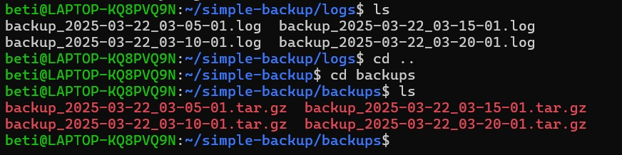
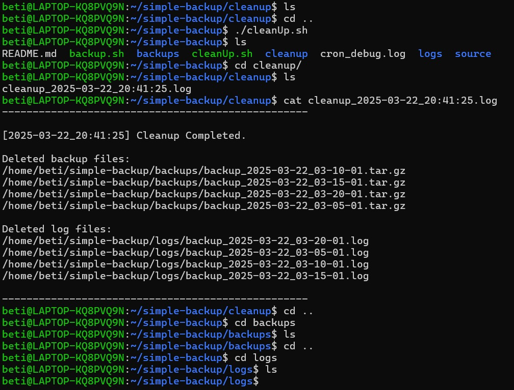
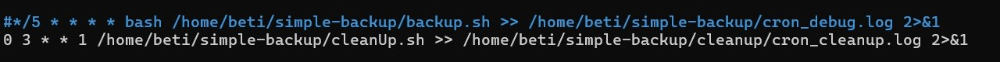

# Automated Backup and Cleanup Script with Bash & Cron

## Project Description

This project contains a Bash script that automatically backs up files from a specified directory.
The script runs at set intervals, compressing files and logging the backup process.
Additionally, it can be scheduled using cron jobs, ensuring automated backups without manual intervention.

## Technologies Used

- Bash Scripting (Automating backup operations)
- tar & gzip (Compressing files)
- Cron Job (Running the script periodically)
- Linux File Management

## How the Script Works

### backup.sh
1) When the script starts, it ensures the correct working directory is set.
2) If missing, required folders (logs/, backups/) are automatically created.
3) Backup and log filenames are generated based on the current date.
4) The source directory (source/) is checked; if missing, the script exits with an error.
5) All files are compressed into a .tar.gz archive and stored in backups/.
6) If the backup is successful, a log entry is recorded.
7) Every operation is logged for easier debugging and monitoring.

### cleanUp.sh
1) Switches to correct working directory.
2) Creates folders if missing.
3) Uses find to locate files older than 7 days in backups/ and logs/.
4) Deletes those files and logs the outcome in cleanup/.
5) If nothing is deleted, logs a warning message.

## Images

</figure><figure style="text-align: center;">
  
  <figcaption><i>📦 This folder example of stores all compressed backup files generated by backup.sh.</i></figcaption>
</figure>

<figure style="text-align: center;">
  
  <figcaption><i>🧹 Sample cleanup log created by cleanUp.sh after deleting old backups and logs.</i></figcaption>
</figure>

<figure style="text-align: center;">
  
  <figcaption><i>⏰ Cron job scheduled to run backup and cleanup scripts automatically.</i></figcaption>
</figure>

## License
This project was created for educational purposes.
